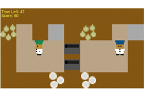
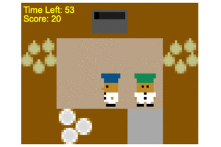

# Introdution
This repo integrates [Human-Aware-RL](https://github.com/HumanCompatibleAI/human_aware_rl/tree/neurips2019) agent models with the [PantheonRL](https://github.com/Stanford-ILIAD/PantheonRL) framework for convenient human-ai coordination study on Overcooked. Changes are done under the [overcookedgym/overcooked-flask](https://github.com/LxzGordon/pecan_human_AI_coordination/tree/master/overcookedgym/overcooked-flask) directory.
<p align="center">
  
  <br>
  
  <br>
</p>

# Instruction for usage

## 1. Install libraries
Install [human-aware-rl (brancu neurips2019)](https://github.com/HumanCompatibleAI/human_aware_rl/tree/neurips2019) and [PantheonRL](https://github.com/Stanford-ILIAD/PantheonRL) accordingly.
## 2. Save models
Save the models from [Human-Aware-RL](https://github.com/HumanCompatibleAI/human_aware_rl/tree/neurips2019) agent models in this [directory](https://github.com/LxzGordon/pecan_human_AI_coordination/tree/master/models) (like the given MEP model for layout simple)
## 3. Start a process
For example, this will start a process on port 8008 with an MEP agent on the layout simple. For dummy agent in the demo layout, set dummy=True
 ```shell
    cd overcookedgym/overcooked-flask
    python app.py --layout=simple --algo=0 --port=8008 --seed=1 --dummy=False
```
